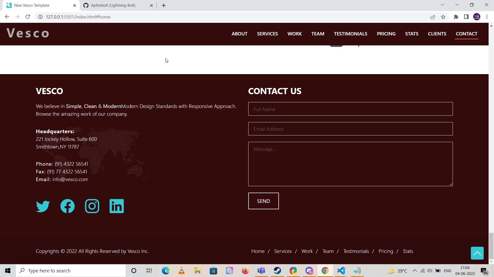
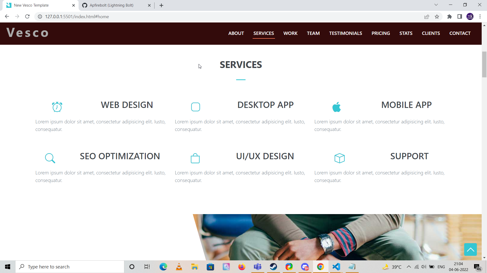
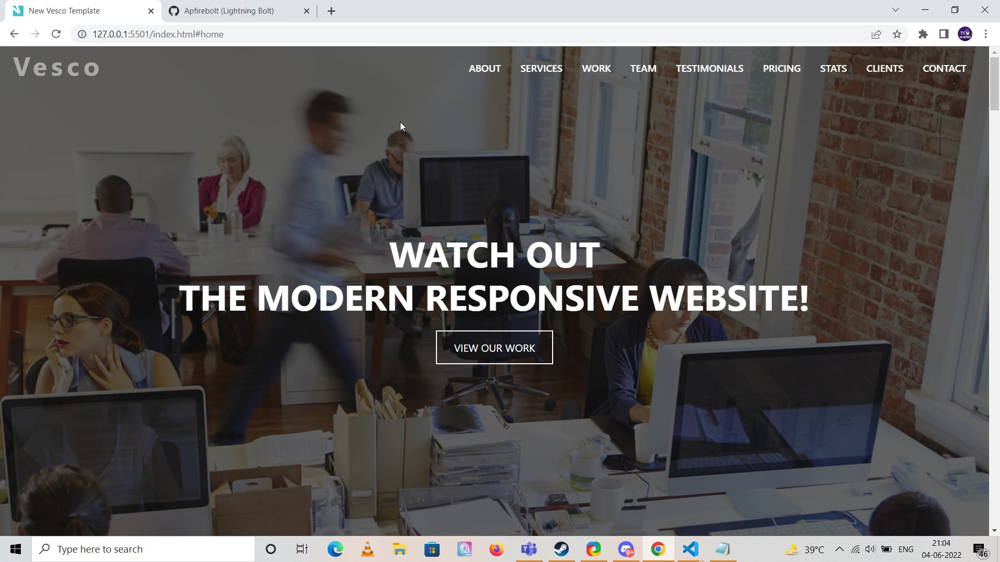

# A Multi-purpose modern Bootstrap 5 theme

This theme was part of the course I enrolled in on Udemy long ago. It had this as the final project. I really liked the design of it. So, I decided to re-master this using Bootstrap 5 and other updated libraries. This project uses various plugins for sliders, animated counters and carousel. The course in consideration can be found here https://www.udemy.com/course/build-modern-responsive-website-with-html5-css3-bootstrap/

A brief description of the plugins used and the purpose they serve is listed below in the table.

## Plugins

| Library	  | Purpose 						|
| ----------- | ----------------------- 		|
| Bootstrap 5 | CSS Framework without JQuery |
| BoxiIcons | Alternative to Font-Awesome icons |
| Swiper JS | Creates Slideshow/Carousel |
| PureCounter JS | Animated Counters |
| Glightbox | Lightbox Gallery |
| Isotope Layout | Gallery image classification |

## Code

As you might know, Bootstrap 5 comes without the required support of JQuery for implementation of dynamic components like Carousel, Accordians and more. This theme uses libraries along with Vanilla JS code to initialize them. Features like scroll to a given tab, changing navigation tab on scroll, changing header classes and more are achieved through Vanilla JS. It uses utility functions to select single/multiple elements at once and handle events on them.

This handles scrolling.

```
const scrollto = (el) => {
  let header = select('#header')
  let offset = header.offsetHeight

  if (!header.classList.contains('header-scrolled')) {
    offset -= 16
  }

  let elementPos = select(el).offsetTop
  window.scrollTo({
    top: elementPos - offset,
    behavior: 'smooth'
  })
}

 /**
 * Scroll with ofset on page load with hash links in the url
 */
  window.addEventListener('load', () => {
    if (window.location.hash) {
      if (select(window.location.hash)) {
        scrollto(window.location.hash)
      }
    }
  });
  
  /**
   * Easy on scroll event listener 
   */
   const onscroll = (el, listener) => {
    el.addEventListener('scroll', listener)
  }
```

## Resources

Following resources were used for motivation in designing this template

- https://templatemo.com/
- https://bootstrapmade.com/
- https://dribbble.com/
- https://www.free-css.com/

## Updates

- 21/3/23

Added Docker deployment script to deploy locally through Nginx container.

```
docker build -t vesco-image . 
docker run -d --name vesco-container -p 80:80/tcp vesco-image
```

The first line builds the image from the local Dockerfile while the second command spawsn a container from the image just created.

## Authors

* **Amit Prafulla (APFirebolt)** - [My Website](https://apgiiit.com)

## License

This project is licensed under the MIT License - see the [LICENSE.md](LICENSE.md) file for details

## Template Screenshots

Please find some of the screenshots of the template. Below is the contact section of this single page template.



Services section.



Navigation menu and hero section. 




